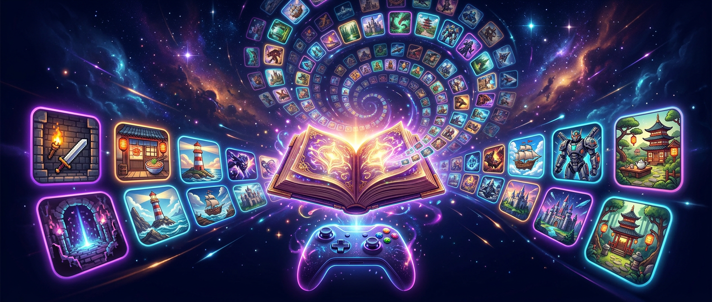
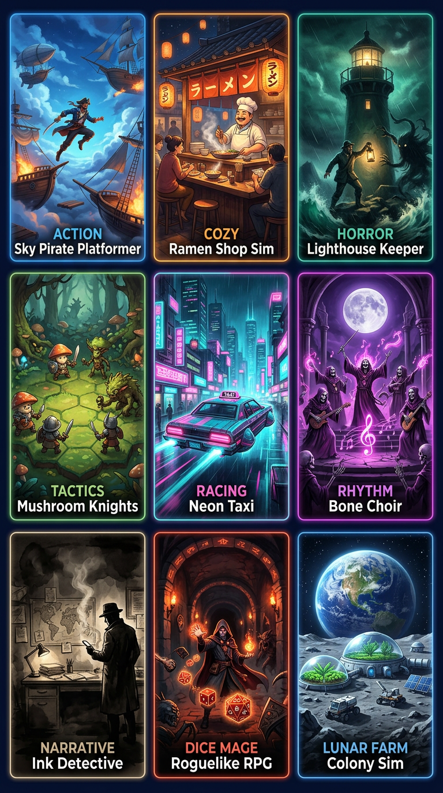

# 게임 생성 프롬프트 도감 game-prompts

> 100종의 "AI 게임 생성 프롬프트"를 모은 정적 도감. 각 항목은 고정된 9단계
> (콘셉트 아트 → 프로토타입 레벨 → 조작감 → 경험치 → 식별 장비 → 규칙 1 → 규칙 2 → 7개 지역 확장 → 수집 시스템)로 구성되며,
> 전체·단계별 복사, 플레인 텍스트 다운로드,
> 자신의 게임 문서나 소설 프로젝트 JSON으로 LLM 신규 생성이 가능합니다.

🌐 [繁體中文](README.md) · [English](README.en.md) · [简体中文](README.zh-CN.md) · [日本語](README.ja.md)



## 목차

- [바로 사용해 보기](#바로-사용해-보기)
- [기능 살펴보기](#기능-살펴보기)
- [여는 방법](#여는-방법)
- [소설 JSON → 게임 프롬프트](#소설-json--게임-프롬프트)
- [내 문서로 새로 생성하기](#내-문서로-새로-생성하기)
- [모델 및 Key 설정](#모델-및-key-설정)
- [프로젝트 구조](#프로젝트-구조)
- [템플릿·데이터 변경 후 다시 빌드하기](#템플릿데이터-변경-후-다시-빌드하기)
- [카테고리 살펴보기](#카테고리-살펴보기)
- [GitHub Pages에 배포하기](#github-pages에-배포하기)
- [라이선스](#라이선스)

## 바로 사용해 보기

- `index.html`을 브라우저에서 열기만 하면 볼 수 있습니다(순수 프론트엔드 모드, 설치 불필요).
- GitHub Pages에 배포하면 링크 공유만으로 누구나 사용할 수 있습니다(역시 순수 프론트엔드 모드).

## 기능 살펴보기

- **검색**: 공백으로 구분한 여러 키워드(AND)로 전체 텍스트 검색, 결과 하이라이트. `/` 또는 `Ctrl+K`로 검색창 포커스.
- **필터 / 정렬 / 보기**: 카테고리 chips, 즐겨찾기 chip, 정렬 드롭다운(표 헤더 클릭도 가능), 표/카드 전환(모바일은 자동 카드).
- **서랍**: 단계별 보기(각 단계 개별 복사, "붙여넣음" 체크로 진행 관리) / 원문 보기. `←` `→`로 이전·다음 항목, `c`로 전체 복사, `f`로 즐겨찾기.
- **공유 URL**: `#cat=분류&q=키워드&p=slug`로 동일한 화면을 복원·공유할 수 있습니다.
- **테마**: 다크 / 라이트, 기본값은 OS 따라가기, 우측 상단 🌙／☀️로 전환.
- **UI 언어**: 번체 중국어 / English / 간체 중국어 / 일본어 / 한국어, 우측 상단에서 전환, 브라우저 언어를 자동 감지해 로컬에 기억. 번역되는 것은 UI와 카테고리 표시 이름뿐이며, 100종 본문·slug·카테고리 키는 그대로이므로 언어를 바꿔도 `#cat=` 링크가 깨지지 않습니다.
- **문서로 생성하기**: 디자인 문서를 붙여넣거나(또는 JSON 업로드, 예: `docs/example-novel.json`), 모델 선택 → 9단계 생성 → **미리 보고 편집 가능** → 도감에 저장. 폼은 자동으로 임시 저장, 생성 중 취소 가능, 4분 무응답 시 타임아웃.
- **모델 / Key 설정**: 다중 공급자 지원(OpenRouter, OpenAI, Anthropic, Gemini, Meta, 커스텀 OpenAI 호환 엔드포인트). Key는 브라우저 localStorage에만 저장되며 키 이름은 Omni Code와 공유합니다.
- **데이터 관리**: 커스텀 항목 목록 / 삭제, 커스텀 항목 JSON 내보내기·가져오기, 현재 필터 결과 Markdown 내보내기, 도감 전체 JSON 내보내기, 진행 상황·즐겨찾기 지우기.

## 여는 방법

| 방법 | 할 수 있는 일 |
| --- | --- |
| `index.html` 직접 열기(file://) 또는 GitHub Pages | 보기·검색·즐겨찾기·복사·다운로드. LLM 생성 결과는 브라우저에 저장되고 `.txt`가 자동 다운로드됩니다 |
| XAMPP / Apache + PHP로 열기 | 위 전부 + 생성 결과를 `prompts/*.txt`에 실제로 쓰기, 커스텀 항목 삭제, 브라우저 직접 연결이 차단된 경우 `api/relay.php`로 중계 |

## 소설 JSON → 게임 프롬프트

자신의 소설 세계관을 게임 기획으로 바꾸고 싶으신가요? 3단계면 됩니다:

1. **소설 생성**: [omnipd.cloud/app](https://omnipd.cloud/app)에 가입해 완전한 스토리 소설을 생성합니다(캐릭터·세계관·챕터 구성까지 자동으로 만들어 줍니다).
2. **JSON 내보내기**: omnipd에서 소설 프로젝트를 JSON 파일로 내보냅니다(줄거리·캐릭터 설정·챕터 등의 텍스트 필드 포함).
3. **게임 프롬프트로 변환**: 이 도감으로 돌아와 "생성" → 방금 받은 JSON 업로드(형식은 `docs/example-novel.json` 참조) → 모델 선택 → 9단계 게임 제작 프롬프트 생성 → 미리 보기·편집 → 저장.

원리: 업로드된 JSON은 먼저 텍스트 추출을 거칩니다(텍스트 필드만, base64 이미지는 자동 제외. `assets/app-gen.js`의 `gpExtractJsonText` 참조).
이어서 같은 장르 참고 예시 3종(그중 1종은 반드시 같은 카테고리, `gpPickRefs`)을 함께 LLM에 전송하고,
반환된 필드를 `gpBuildPrompt`가 9단계 템플릿으로 전체 텍스트 조립하므로 형식은 프로그램이 보장합니다.

## 내 문서로 새로 생성하기

1. "생성"을 눌러 게임 디자인 문서(플레이 방식·캐릭터·세계관……구체적일수록 좋음)를 붙여넣거나 JSON을 직접 업로드합니다.
2. 모델을 선택합니다(처음에는 Key 설정에서 API Key 등록).
3. 생성 → LLM 응답 대기 → 미리 보기 페이지에서 제목·카테고리·각 필드·전체 텍스트를 편집합니다.
4. 저장: PHP 백엔드가 있으면 `prompts/<slug>.txt`에 쓰고 도감을 다시 빌드, 순수 프론트엔드 모드에서는 브라우저 저장 + `.txt` 자동 다운로드가 됩니다.

## 모델 및 Key 설정

- OpenRouter, OpenAI, Anthropic, Gemini, Meta AI 및 커스텀 OpenAI 호환 엔드포인트를 지원합니다.
- Key는 자신의 브라우저 localStorage에만 존재하며 외부 서버로 전송되지 않습니다(키 이름은 Omni Code와 공유하므로 한 번만 등록하면 됩니다).
- 프론트엔드는 공급자 직접 연결을 우선하며, CORS로 차단되면 PHP 백엔드가 자동으로 `api/relay.php` 중계로 전환합니다(공급자 도메인 화이트리스트 방식, Key는 디스크에 남지 않습니다).

## 프로젝트 구조

```
index.html            빌드 산출물: _gen/template.html + 데이터로 생성. 직접 수정 금지
assets/app-gen.js     LLM 생성·모델/Key 설정·데이터 관리(페이지 내 window.GP에 의존)
assets/i18n.js        5개 언어 UI 사전(dict) + 카테고리 표시 이름(cats). 언어 추가 = langs 항목 + 같은 키 사전 추가
prompts/*.txt         100종 원문. 파일 이름 = slug
docs/example-novel.json  소설 JSON 샘플(업로드해서 생성 흐름을 시험할 수 있음)
api/ping.php          백엔드 감지
api/relay.php         AI 중계(공급자 도메인 화이트리스트 방식, Key 저장 안 함)
api/save_prompt.php   prompts/<slug>.txt + _gen/custom.json에 쓰기, index.html 다시 빌드
api/delete_prompt.php custom.json 안의 항목만 삭제, index.html 다시 빌드
_gen/template.html    페이지 템플릿(디자인 시스템 + 주 프로그램)
_gen/data_1..4.php    내장 100종 데이터(각 18개 필드)
_gen/lib_catalog.php  PHP 버전: 내장 + 커스텀을 합쳐 템플릿 적용
_gen/build_index.js   Node 버전: lib_catalog.php와 동등. PHP가 없을 때 사용
_gen/build_index.php  PHP CLI 다시 빌드 진입점
_gen/custom.json      커스텀 항목 목록(백엔드 모드용. .gitignore 처리됨)
_gen/gen.php          data_*.php에서 prompts/*.txt 재생성
```

## 템플릿·데이터 변경 후 다시 빌드하기

```bash
node _gen/build_index.js
```

PHP가 있는 경우:

```bash
php _gen/build_index.php
```

둘은 동일한 출력입니다(내장 100종 + `_gen/custom.json`). `index.html`이 참조하는 `assets/*.js`에는 내용 해시 기반 cache-busting이 붙으므로 JS 변경 후에도 다시 빌드하세요. `data_*.php` 내용을 변경했다면 먼저 `php _gen/gen.php`로 `prompts/*.txt`를 재생성한 뒤 다시 빌드합니다.



## 카테고리 살펴보기

| 카테고리 | 개수 |
| --- | --- |
| 액션·어드벤처 | 28 |
| 로그라이크·RPG | 17 |
| 시뮬레이션·경영 | 10 |
| 캐주얼·힐링 | 10 |
| 전략·전술 | 9 |
| 내러티브·퍼즐 | 9 |
| 레이싱·스포츠 | 7 |
| 호러·미스터리 | 6 |
| 음악·리듬 | 4 |
| **합계** | **100** |

## GitHub Pages에 배포하기

1. 이 디렉터리를 GitHub 저장소에 push합니다.
2. 저장소 Settings → Pages → Source에서 `Deploy from a branch` 선택, 브랜치 `main`·폴더 `/ (root)` 지정.
3. 몇 분 기다리면 `https://<사용자>.github.io/<저장소>/`에서 도감이 열립니다.
4. 주의: GitHub Pages는 정적 호스팅이라 `api/*.php`가 실행되지 않습니다——위 표의 "순수 프론트엔드 모드"와 같습니다. 보기·검색·생성(LLM 직접)·다운로드는 정상 동작하고, 커스텀 항목은 브라우저 localStorage에 저장되어 저장소에 다시 쓰이지 않습니다. `_gen/custom.json`은 `.gitignore` 처리되어 있어 개인 데이터 오push를 막을 수 있습니다.

## 라이선스

MIT License([LICENSE](LICENSE) 참조).
